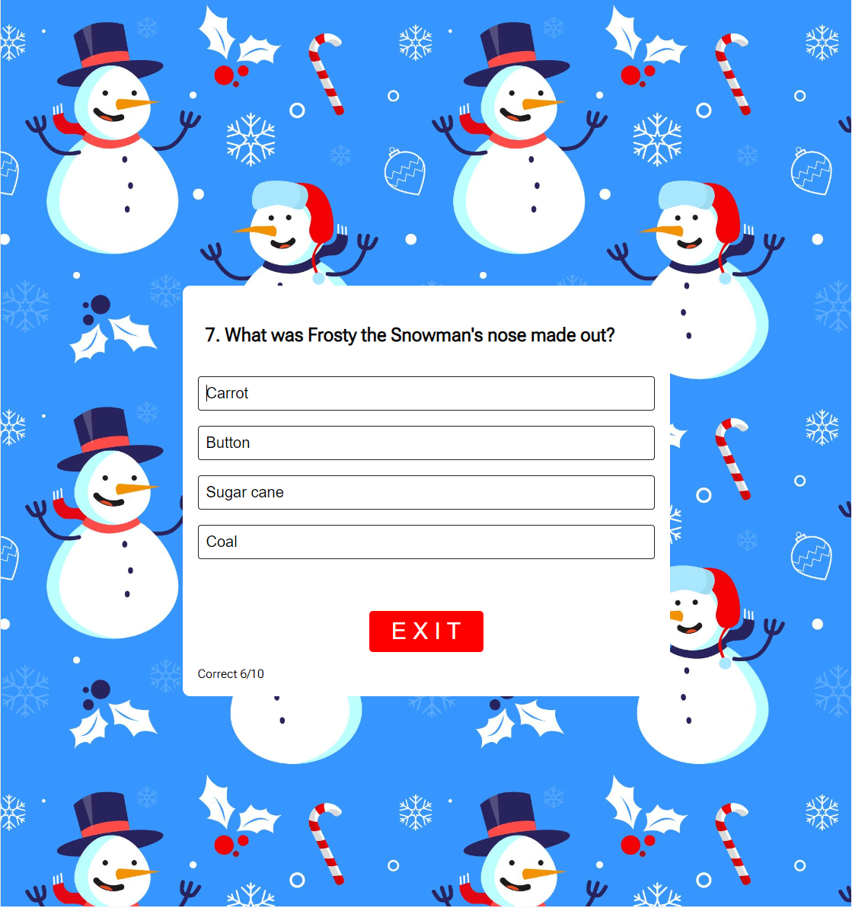
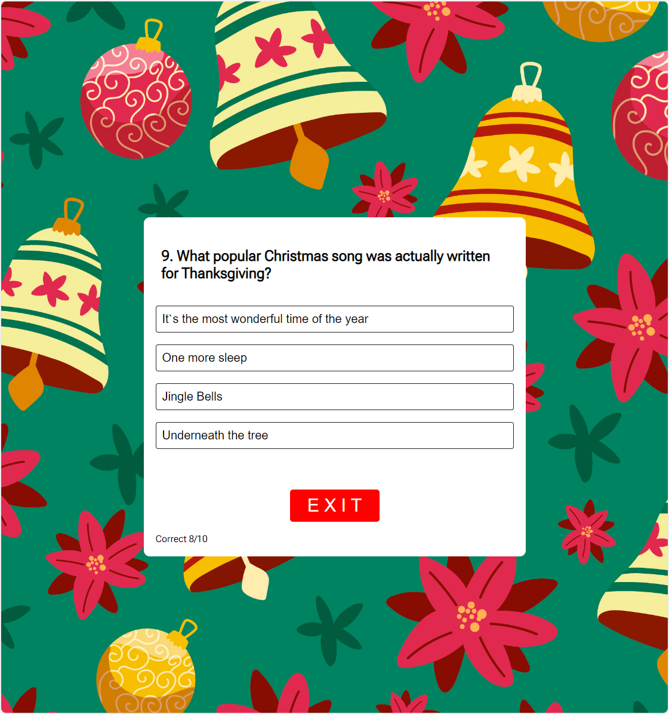
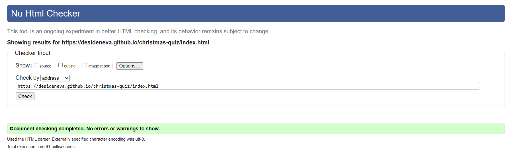
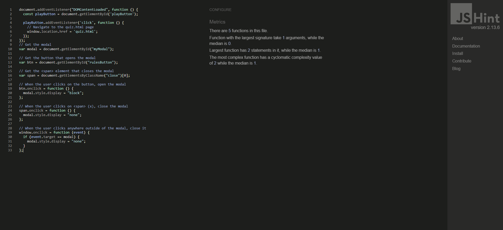
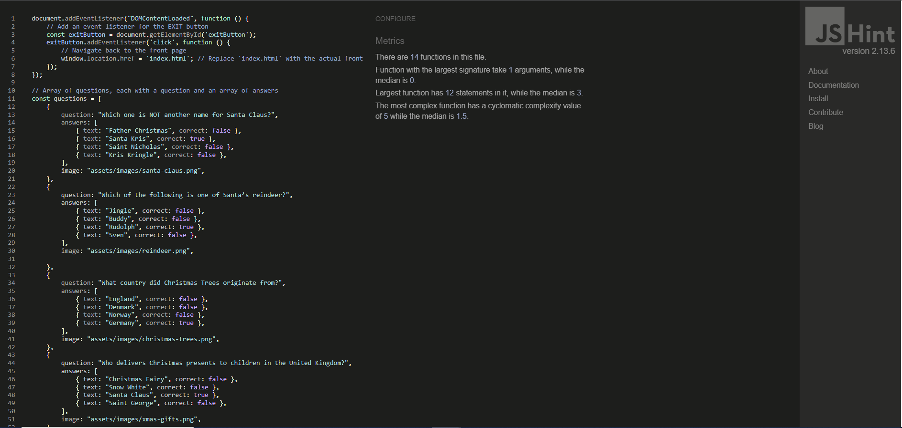
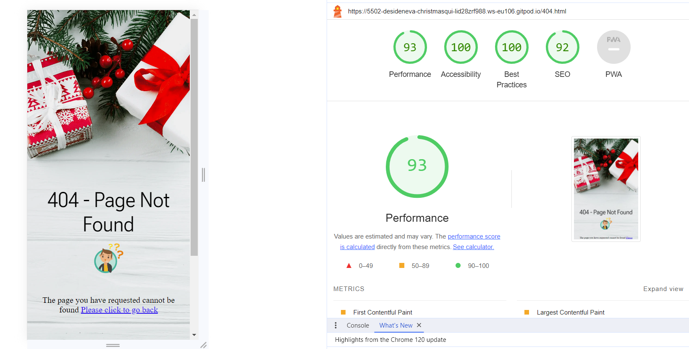

# Christmas Quiz

Visit the deployed site: [Christmas Quiz](https://desideneva.github.io/christmas-quiz/)

## INITIAL DESIGN
 For my project, I created a fun and easy-to-use website all about Christmas. It's designed for people of all ages who want to test their knowledge of holiday traditions and have a good time.

 The main features that I wanted to include are:

###  Easy Navigation:

   * A user-friendly navigation system to ensure  easy access to the quiz questions, an exit option, and a clear path to restart or play again.

###  Clear and Entertaining Content:

  * Brief and entertaining information is presented in a visually appealing manner. The quiz questions are accompanied by vibrant images related to Christmas, enhancing the overall user experience.

###  Festive Color Scheme:

  * I have included shades of red, green, and white, cheerful and festive colors to evoke the holiday spirit, creating a visually pleasant atmosphere for users.

### Engaging Visuals:

* Each question is accompanied by relevant themes as background, adding an extra layer of enjoyment for the participants.

### Interactive Elements:

* I have implemented interactive elements, such as buttons for selecting answers, and a score counter to keep users engaged throughout the quiz.

### Responsive Design:

* The quiz is made accessable on desktops, tablets and mobile phones to suit larger audience.

### Playful Tone:

* The quiz is designed to be fun, with friendly and playful style. It's like having a holiday game with friends. The goal is to make the quiz not only informative but also enjoyable for participants.

In summary, the Christmas Quiz project aims to provide a delightful and educational experience for individuals of all ages, celebrating the spirit of the holiday season through an interactive and visually appealing platform.

## USER EXPERIENCE

The Christmas Quiz website is made for everyone, whether you are new to Christmas or a seasoned holiday lover.

### New to Christmas:

* If you are just discovering Christmas traditions, the website gently introduces you to the festive magic without overwhelming details.

### Casual Christmas Fans:

* For those who know a bit about Christmas, the quiz is a fun way to learn more and enjoy the holiday spirit.

### Christmas Enthusiasts:

* If you're a Christmas expert, the quiz is a cheerful refresher, letting you test your knowledge and relish in the joy of the season.

No matter where you are on your Christmas journey, the website aims to make your experience merry and bright!

 ## USER STORIES

### Client Goals

* The site needs to be easily accessible.
* The navigation menu needs to be simple to use on a range of devices, including desktop, tablet and mobile.
* Maneuvering around the quiz should be straightforward.
* The quiz should be informative and all the text should be easy to read.
* The images should be clear and not stretched or squashed.

#### First Time Visitors

* I want it to be easy to understand how to navigate throughout the quiz.
* I want the content to be easily read and understandable.

#### Returning User

* To enjoy the Christmas quiz for a festive mood boost.
* To share the quiz with others for a fun and informative experience.
* To recommend the site to friends and family.
 
## EXISTING FEATURES

### The Front Page Image

* The front page image features a festive setting with a Christmas twig, a candle, and wrapped presents. It radiates the cozy and joyful atmosphere of the holiday season, creating a warm welcome for visitors.
 

### The PLAY Button

* The play button is there to catch your attention and encourages you to click on it. When you hover over it, the color changes in green, giving you a hint that it's clickable and ready for you to start something fun, like a Christmas quiz.

### The Rules Button

* The rules button is like a guidebook. When you hover over it, it changes the background shade. Clicking it reveals a pop-up that explains what you need to know before diving into the Christmas quiz. It's like a friendly heads-up before you begin.

### The Quiz Questions

* The quiz consists of 10 festive questions, with each question presented on a separate screen for users to answer. The EXIT button on each question screen gives an option for users to leave the quiz at any point and return to the front page. It provides flexibility for participants who may want to exit the quiz before completing all the questions.

* Only a few quiz questions are provided here; the remaining questions can be discovered by playing the quiz.

* In the quiz, when the correct answer is selected, it lights up in green, giving positive feedback. The "Next Question" button stays hidden until an answer is chosen. Once selected, it becomes visible, allowing the user to proceed to the next question.  

* If you pick the wrong answer, it lights up in red and the correct one shows up in green, helping you learn. Your score is always visible at the bottom-left, so you can track your progress easily. 

* On the final score page, your quiz result is summarized, providing options to either play the quiz once more to improve your performance or exit, with the opportunity to return later.

* On the final score page, upon achieving the maximum score, a congratulatory message is displayed, accompanied by an option to exit the quiz with satisfaction.

### The 404 Page

* This page is typically designed to maintain the website's aesthetics. The 404 error page informs users that the requested web page was not found. It helps guide them back to the site's main content.

## FEATURES TO IMPLEMENT

Here are some additional features you can consider adding to make your Christmas quiz more entertaining:

### Background Music:

* Add festive background music that plays when the user starts the quiz. Allow an option to mute or adjust the volume.

### Timer:

* Introduce a timer for each question to add a time-based challenge. Display how quickly users can answer each question.

### More Questions:

* Expand the quiz by adding more diverse and interesting Christmas-related questions. This keeps the quiz engaging for users who might play it multiple times.

### Levels of Difficulty:

* Implement difficulty levels for users to choose from. For example, easy, medium, and hard difficulty levels with varying degrees of complexity in questions.

### Festive Themes:

* Introduce different festive themes for the quiz interface. Change the background, colors, and design elements based on the holiday spirit.

### Scoring System:

* Enhance the scoring system by giving bonus points for answering questions quickly or consecutively. Display a leaderboard for high scores.

### Hints and Clues:

* Incorporate a hint or clue system for users who may find certain questions challenging. They can use hints in exchange for a slight reduction in points.

## SOLVED BUGS

### Button Display Issue:

* Bug: Buttons were not displaying correctly on certain screens, causing layout problems.

* Solution: Adjusted the CSS styling for buttons and container elements to ensure proper positioning and display across various screen sizes.

### Score Display Not Updating:

* Bug: The score display was not updating correctly after each question.

* Solution: Implemented a function (updateScoreDisplay()) to dynamically update the score display, ensuring it accurately reflects the user's progress.

### Background Image not Changing:

* Bug: The background image for each question screen was not updating as intended.

* Solution: Modified the logic in the showQuestion() function to correctly set the background image based on the current question.

### Next Button Displaying on Score Screen:

* Bug: The "Next Question" button was incorrectly displaying on the score screen.

* Solution: Adjusted the logic in the handleNextButton() function to differentiate between displaying the next question and the play again option.

### Scoring Logic Issue:

* Bug: In some cases, the scoring logic was not accurately counting correct answers.

* Solution: Reviewed and corrected the scoring logic in the selectAnswer() function, ensuring points were correctly awarded for correct answers.

## TECHNOLOGIES USED
### Languages

### Version Control

### Browsers

 
### Wireframes

### Site Deployment

## DEPLOYMENT

### Initial Deployment

This site was deployed using GitHub Pages with the following steps below:

1. Login or Sign Up to [GitHub](www.github.com).
2. Create a new repository named "christmas-quiz".
3. Once created, click on "Settings" on the navigation bar under the repository title.
4. Click on "Pages", on the left-hand side below Secrets.
5. Under "Source", choose which branch you wish to deploy, In most cases, it will be "main".
6. Choose which folder to deploy from, generally from "/root".
7. Click "Save", then wait for it to be deployed. It may take some time for the page to be fully deployed.
8. The URL will be displayed above the "source" section in GitHub Pages.

### How to Fork a Repository

If you need to make a copy of a repository:

1. Login or Sign Up to [GitHub](www.github.com).
2. On GitHub, go to [desideneva/christmas-quiz](desideneva/christmas-quiz).
3. In the top right corner, click "Fork".

### How to Make a Local Clone

If you need to make a local clone:

1. Login to [GitHub](www.github.com).
2. Under the repository name, above the list of files, click "Code".
3. Here you can either Clone or Download the repository.
4. You should close the repository using HTTPS, clicking on the icon to copy the link.
5. Open Git Bash.
6. Change the current working directory to the new location, where you want the cloned directory to be.
7. Type git clone and then paste the URL you copied in step 4.
8. Press Enter, and your local clone will be created.

## TESTING

Every aspect of the project was tested on the browsers below.

### User Testing

* The navigation menu needs to be simple to use on a range of devices, including desktop, tablet and mobile.

  * The navigation buttons are visible on all pages with an indicator to show which question the user is on.
  * The navigation buttons are easy to read and easy to understand what each button does.

* Maneuvering around the site should be simple and straightforward.  

  * Everything is laid out in a clear manner that is simple to use.
   
* The images should be clear and not stretched or squashed.

  * All images are visibly clear on all pages.

### Styling and Layout

| Expected    | Result |
| :---------: | :----: |
| Ensure main page loads correctly | Pass |
| Ensure all pages load correctly and functioning as expected | Pass |
| Ensure all backgrounds images load correctly | Pass |

### Responsiveness

| Page | Images and Content Responsive | Text Content Readable    |
| :--: |:----------------------------: | :----------------------: |
| Home Page | Pass | Pass |
| Questions Pages | Pass | Pass |
| Score Page | Pass | Pass |

### Code Validators

The W3C Markup and CSS Validators were used to validate my project to make sure there were no errors within the site. 

 * Home page
 

 * Quiz pages
 

  * 404 Error page
 

 

  
   

  * Home page

  

  * Quiz pages

   

### Lighthouse Testing 

* Desktop

* Mobile

#### Performance

* I was very happy with my initial lighthouse scores.

#### Accessibility

* While writing my code, I was careful to ensure that it was fully accessible.
* All text has good visibility on the backgrounds I chose.

#### Best Practices

* All images are shown in the correct aspect ratio, so as not to look stretched or pixelated.

#### SEO

* I ensured the site had all the relevant meta tags needed.
* All font sizes are legible on all screen sizes.

## CREDITS

### Content

The main guidance and instructions in this project were from [Code Institute](https://codeinstitute.net)

* The main structure of the quiz and the code were taken from the following YouTube tutorials:

  https://www.youtube.com/watch?v=PBcqGxrr9g8&t=22s
  https://www.youtube.com/watch?v=WiLTsxjCmWQ
  https://www.youtube.com/watch?v=WHHYz8rZmDU
  
* The Favicon was taken from [Favicon](https://icons8.com/icons/set/favicon)

* The fonts used in the project were imported from [Google Fonts](https://fonts.google.com/)

### Media

* All background images were taken from [FREEP!K](https://www.freepik.com/search?format=search&page=5&query=traditional+restaurant+background)

## ACKNOWLEDGEMENTS

* I would like to give a big thanks to Emanuel Silva from [Slack](https://slack.com/intl/en-gb/) for all his help, effort, guidance and patience he has provided during this project.

* I would also like to thank my mentor Daisy for all her support, understanding, advice and for explaining things to me when I did not understand.

 
